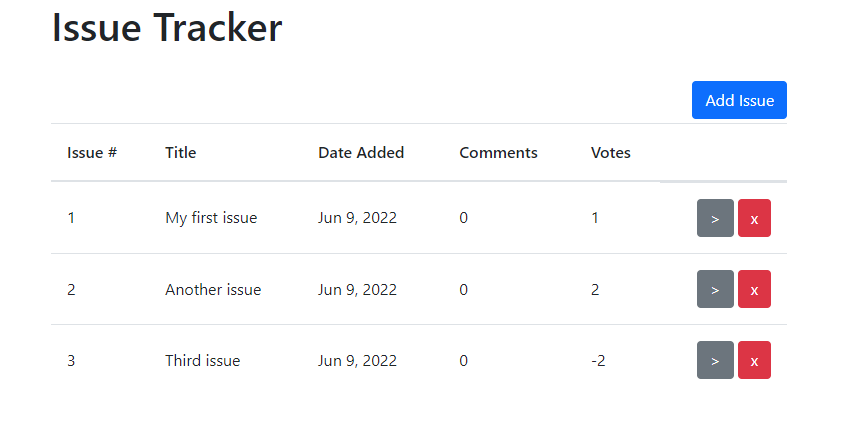
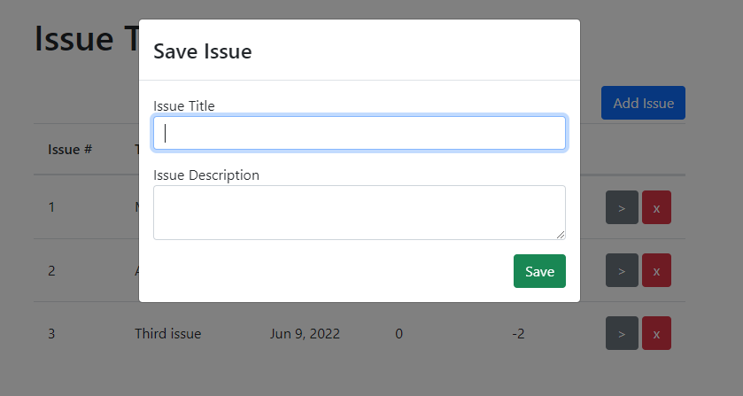
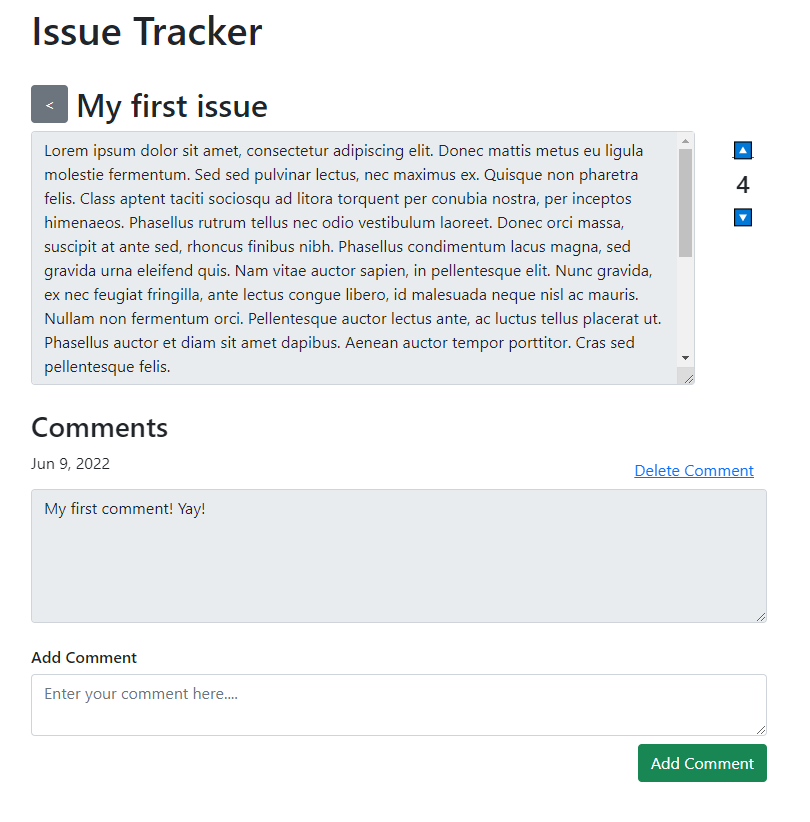

# Issue Tracker

For this assignment, please implement a (minimal) issue tracker. In essence, the functionality consists of creating/deleting issues and adding votes and comments to issues.
Below you will find a more detailed description but it is up to you to design the API, service calls and user interface. Everything is fine as long as it makes sense
and the minimum required functionality is present. As long as you can explain and "defend" your approaches and design decisions, it's fair game. Please note that there won't be any
"extra points" if you add functionality. But your solution _will_ be the discussion basis when we invite you.

Please provide your finished solution as a a git repository (can be GitHub, GitLab, etc.). You can either make it publicly available or invite philipp.hafner@smart-study.at with at least read privileges.
Your solution has to be implemented using a typescript frontend (our recommendation is Angular) and a backend, written in either PHP (recommendation CodeIgniter) or Python (recommendation Django).
You can use _any_ frameworks/libraries (for example ui frameworks) that you are familiar with and that make your life easier. Efficiency is key. You do not need to provide tests, but they are of course allowed.

The front and backend must communicate via HTTP requests and a RESTFul API. We recommend using JSON as DTOs, but if you prefer XML thats fine as well. You do not have to implement any security features (authentication, CORS, etc.)

The application must be easy to setup, so if you use a database, please stick to SQLite or anything else that can be run without any other "big" dependencies. You can of course provide a short readme, explaining on how to run your solution. 
Docker is fine but of course not required.

Here is a list of hard requirements for the application:

 - It must be possible to create an "Issue". An Issue has at least a `title (string)`, a `description (string)`, a `creation date (Date)` and `votes (integer)`
 - It must be possible to see an overview of Issues (maybe through a table?)
 - Issues must be deletable
 - Issues can be upvoted or downvoted (similar to the mechanic on e.g. Stackoverflow). The current vote should be displayed. 
 - Issues can be commented on. A comment has at least a `text (string)` a `creation date (Date)` and an associated issue.
 - Comments can be deleted.

Here are a few screenshots to give you an idea on how the IssueTracker could look:

